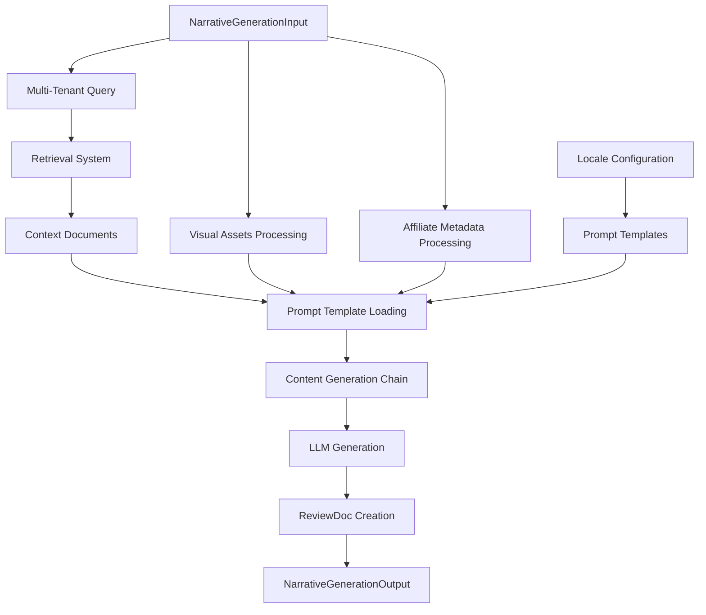

# 🎯 Narrative Generation LCEL Chain Documentation

**Task-012**: World-class narrative-style content generation with retrieval integration

## Overview

The Narrative Generation LCEL Chain is a sophisticated content generation system that produces high-quality, narrative-style casino reviews and affiliate content. It integrates retrieval-augmented generation (RAG) with multi-tenant support, visual content processing, and affiliate metadata integration.

## Key Features

### 🎨 Multi-Locale Support
- **Prompt Templates**: Locale-specific prompt templates in `/src/prompts/review_narrative_{locale}.txt`
- **Supported Locales**: English (en), German (de), French (fr), Spanish (es)
- **Automatic Fallback**: Falls back to English for unsupported locales
- **Cultural Adaptation**: Content tone and style adapted for different markets

### 🔍 Retrieval Integration
- **Multi-Tenant RAG**: Integrates with Multi-Tenant Retrieval System (Stream 1D)
- **Context Enrichment**: Retrieves 95+ field casino intelligence data
- **Source Attribution**: Tracks and cites all retrieved sources
- **Confidence Scoring**: Provides retrieval confidence metrics

### 🖼️ Visual Content Processing
- **Asset Integration**: Processes screenshots, promotional images, and media assets
- **Natural References**: Incorporates visual content naturally in narrative
- **Metadata Extraction**: Extracts visual context for content generation
- **Multi-Format Support**: Handles various image types and formats

### 🤝 Affiliate Metadata Integration
- **Commission Structures**: Incorporates affiliate commission information
- **Marketing Materials**: References available marketing assets
- **Compliance Requirements**: Ensures affiliate compliance standards
- **Performance Tracking**: Supports advanced attribution methods

### 📊 Structured Output
- **ReviewDoc Generation**: Produces complete `ReviewDoc` schema objects
- **Quality Scoring**: Automated content quality assessment
- **Compliance Validation**: Built-in compliance checking hooks
- **WordPress Integration**: Ready for WordPress publishing pipeline

## Architecture



## Components

### Core Classes

#### `NarrativeGenerationChain`
Main LCEL chain orchestrating the entire generation process.

```python
from src.chains.narrative_generation_lcel import NarrativeGenerationChain

chain = NarrativeGenerationChain(
    retrieval_system=retrieval_system,
    llm=ChatOpenAI(model="gpt-4o", temperature=0.7)
)

result = chain.generate_narrative(input_data)
```

#### `NarrativePromptLoader`
Manages locale-specific prompt template loading with caching.

```python
from src.chains.narrative_generation_lcel import NarrativePromptLoader

loader = NarrativePromptLoader()
template = loader.load_prompt_template("de")  # German template
locales = loader.get_available_locales()      # ["en", "de", "fr", "es"]
```

#### `VisualContentProcessor`
Processes visual assets and generates contextual descriptions.

```python
from src.chains.narrative_generation_lcel import VisualContentProcessor

# Format visual assets for narrative
context = VisualContentProcessor.format_visual_context(visual_assets)
metadata = VisualContentProcessor.extract_visual_metadata(visual_assets)
```

#### `AffiliateMetadataProcessor`
Processes affiliate-specific metadata and compliance requirements.

```python
from src.chains.narrative_generation_lcel import AffiliateMetadataProcessor

affiliate_context = AffiliateMetadataProcessor.format_affiliate_context({
    "commission_structure": "15% revenue share",
    "compliance_requirements": ["18+ verification", "KYC"]
})
```

### Input/Output Schemas

#### `NarrativeGenerationInput`
Complete input specification for narrative generation.

```python
from src.chains.narrative_generation_lcel import NarrativeGenerationInput
from src.schemas.review_doc import TenantConfiguration, MediaAsset

input_data = NarrativeGenerationInput(
    casino_name="Betway Casino",
    tenant_config=TenantConfiguration(
        tenant_id="crashcasino",
        brand_name="CrashCasino",
        locale="en",
        voice_profile="enthusiastic"
    ),
    query_context="comprehensive review with bonuses and games",
    visual_assets=[
        MediaAsset(
            filename="casino-homepage.png",
            type=MediaType.SCREENSHOT,
            alt_text="Casino game lobby"
        )
    ],
    affiliate_metadata={
        "commission_structure": "10% revenue share",
        "compliance_requirements": ["18+ verification"]
    }
)
```

#### `NarrativeGenerationOutput`
Structured output containing generated content and metadata.

```python
class NarrativeGenerationOutput(BaseModel):
    generated_content: str              # Raw HTML content
    review_doc: ReviewDoc              # Complete structured document
    retrieval_context: List[Document] # Retrieved context documents
    generation_metadata: Dict[str, Any] # Processing metadata
```

## Usage Examples

### Basic Usage

```python
from src.chains.narrative_generation_lcel import create_narrative_generation_chain
from src.chains.multi_tenant_retrieval_system import create_multi_tenant_retrieval_system

# Create components
retrieval_system = create_multi_tenant_retrieval_system(vector_store)
narrative_chain = create_narrative_generation_chain(
    retrieval_system=retrieval_system,
    llm_model="gpt-4o",
    temperature=0.7
)

# Generate narrative
result = narrative_chain.generate_narrative(input_data)

print(f"Generated {len(result.generated_content)} characters")
print(f"Retrieved {len(result.retrieval_context)} context documents")
print(f"Confidence score: {result.generation_metadata['retrieval_score']}")
```

### Multi-Locale Generation

```python
# Generate content in multiple locales
locales = ["en", "de", "fr", "es"]

for locale in locales:
    tenant_config.locale = locale
    input_data.tenant_config = tenant_config
    
    result = narrative_chain.generate_narrative(input_data)
    
    print(f"{locale}: {len(result.generated_content)} characters generated")
```

### Visual Content Integration

```python
from src.schemas.review_doc import MediaAsset, MediaType

# Add visual assets
visual_assets = [
    MediaAsset(
        filename="casino-homepage.png",
        type=MediaType.SCREENSHOT,
        alt_text="Casino main interface",
        caption="Game lobby with featured slots"
    ),
    MediaAsset(
        filename="welcome-bonus.jpg", 
        type=MediaType.PROMOTIONAL,
        alt_text="Welcome bonus offer",
        caption="$1000 bonus + 100 free spins"
    )
]

input_data.visual_assets = visual_assets
result = narrative_chain.generate_narrative(input_data)

# Visual content will be naturally referenced in the generated narrative
```

### Affiliate Metadata Configuration

```python
# Configure affiliate-specific metadata
affiliate_metadata = {
    "commission_structure": "15% revenue share + bonuses",
    "marketing_materials": ["banners", "email templates", "landing pages"],
    "compliance_requirements": ["18+ verification", "KYC", "responsible gambling"],
    "payment_terms": "NET15",
    "tracking_method": "cookies + server postback",
    "custom_bonus_codes": ["EXCLUSIVE100", "VIPBONUS"]
}

input_data.affiliate_metadata = affiliate_metadata
result = narrative_chain.generate_narrative(input_data)
```

## Prompt Template System

### Template Structure

Prompt templates are stored in `/src/prompts/` with the pattern `review_narrative_{locale}.txt`:

```
src/prompts/
├── review_narrative_en.txt    # English template
├── review_narrative_de.txt    # German template  
├── review_narrative_fr.txt    # French template
└── review_narrative_es.txt    # Spanish template
```

### Template Variables

Templates support the following variables:

- `{context}` - Retrieved contextual information
- `{images}` - Formatted visual content descriptions
- `{casino_name}` - Name of the casino being reviewed
- `{locale}` - Target locale/language
- `{brand}` - Brand name for the content
- `{voice_profile}` - Content voice/tone profile
- `{affiliate_context}` - Affiliate-specific requirements

### Creating Custom Templates

To add a new locale template:

1. Create `/src/prompts/review_narrative_{locale}.txt`
2. Include all required variables
3. Ensure compliance requirements are included
4. Test with the prompt loader

Example template structure:

```
You are a world-class casino reviewer writing in {locale}. Use ONLY the retrieved context and weave facts into flowing paragraphs.

CONTEXT: {context}
CASINO: {casino_name}  
IMAGES: {images}
AFFILIATE: {affiliate_context}

REQUIREMENTS:
- Generate narrative-style content
- Include 18+ age requirement
- Reference visuals naturally
- Maintain {voice_profile} tone

Generate the review:
```

## LCEL Chain Architecture

The narrative generation uses LangChain Expression Language (LCEL) for composable, streaming-capable chains:

```python
# Chain composition pattern
chain = (
    RunnablePassthrough.assign(
        retrieval_query=RunnableLambda(prepare_retrieval_query)
    )
    | RunnablePassthrough.assign(
        retrieval_result=RunnableLambda(perform_retrieval)
    )
    | RunnablePassthrough.assign(
        metadata=RunnableLambda(process_metadata)
    )
    | RunnablePassthrough.assign(
        generated_content=RunnableLambda(generate_content)
    )
    | RunnablePassthrough.assign(
        review_doc=RunnableLambda(create_review_doc)
    )
    | RunnableLambda(create_output)
)
```

### Chain Steps

1. **Retrieval Query Preparation**: Convert input to `MultiTenantQuery`
2. **Context Retrieval**: Execute multi-tenant retrieval for background information
3. **Metadata Processing**: Process visual assets and affiliate metadata
4. **Content Generation**: Generate narrative using LLM with formatted prompt
5. **ReviewDoc Creation**: Structure output as `ReviewDoc` with full metadata
6. **Output Assembly**: Create final `NarrativeGenerationOutput`

## Integration Points

### Multi-Tenant Retrieval System (Stream 1D)
- **Query Generation**: Converts input to `MultiTenantQuery` with tenant filtering
- **Context Retrieval**: Retrieves relevant casino intelligence and content
- **Source Attribution**: Maintains source tracking for citations

### ReviewDoc Schema (Stream 1A)
- **Structured Output**: Generates complete `ReviewDoc` objects
- **Metadata Integration**: Includes generation metadata and parameters
- **Compliance Fields**: Populates compliance and quality assessment fields

### Supabase Vector Store (Stream 1B)
- **Content Retrieval**: Accesses stored casino intelligence and content
- **Tenant Filtering**: Applies tenant-specific filtering during retrieval
- **Metadata Enrichment**: Uses stored metadata for content generation

## Performance Considerations

### Optimization Strategies

1. **Template Caching**: Prompt templates are cached after first load
2. **Parallel Processing**: Independent operations run in parallel where possible  
3. **Batch Retrieval**: Multiple context documents retrieved in single operation
4. **Streaming Output**: LCEL chains support streaming for real-time feedback

### Resource Usage

- **Memory**: ~50MB for loaded templates and cached components
- **Network**: Retrieval queries and LLM API calls
- **Processing Time**: ~10-20 seconds per generation (depending on complexity)
- **Token Usage**: ~2,000-4,000 tokens per generation

### Scaling Considerations

- **Concurrent Generation**: Multiple chains can run simultaneously
- **Resource Pooling**: Share retrieval systems across chain instances
- **Caching**: Cache frequently requested content and templates
- **Rate Limiting**: Apply rate limits for LLM API usage

## Testing

### Test Suite

Comprehensive test suite in `tests/test_narrative_generation_lcel.py`:

```bash
# Run narrative generation tests
python -m pytest tests/test_narrative_generation_lcel.py -v

# Run with coverage
python -m pytest tests/test_narrative_generation_lcel.py --cov=src.chains.narrative_generation_lcel
```

### Test Categories

1. **Unit Tests**: Individual component functionality
2. **Integration Tests**: Chain execution with mocked dependencies  
3. **Multi-Locale Tests**: Template loading and locale-specific generation
4. **Visual Processing Tests**: Visual asset processing and metadata extraction
5. **Error Handling Tests**: Exception scenarios and recovery

### Demo Script

Interactive demo in `examples/narrative_generation_demo.py`:

```bash
# Run the demo
python examples/narrative_generation_demo.py

# Demo covers:
# - Multi-locale generation scenarios
# - Visual content processing
# - Affiliate metadata integration
# - Complete workflow demonstration
```

## Error Handling

### Common Issues

1. **Missing Prompt Templates**: Falls back to English template
2. **Retrieval Failures**: Graceful degradation with cached or default content
3. **LLM API Errors**: Retry logic with exponential backoff
4. **Invalid Input Data**: Validation errors with descriptive messages

### Error Recovery

- **Template Fallback**: Missing locale templates fall back to English
- **Partial Content**: Generate content with available data if retrieval partially fails
- **Validation Bypass**: Skip non-critical validation in degraded mode
- **Logging**: Comprehensive error logging for debugging

## Compliance and Safety

### Content Safety

1. **18+ Requirements**: All templates include age verification requirements
2. **Responsible Gambling**: Mandatory responsible gambling disclaimers
3. **Factual Accuracy**: Content based only on retrieved, verified information
4. **Source Attribution**: All claims are properly sourced and citable

### Affiliate Compliance

1. **Disclosure Requirements**: Affiliate relationships clearly disclosed
2. **Regulatory Compliance**: Adheres to jurisdiction-specific requirements  
3. **Marketing Guidelines**: Follows affiliate program marketing guidelines
4. **Quality Standards**: Maintains high content quality standards

## Future Enhancements

### Planned Features

1. **Additional Locales**: Support for more languages and regional variations
2. **Advanced Visual Processing**: AI-powered image analysis and description
3. **Dynamic Templates**: Template customization based on content requirements
4. **Quality Scoring**: Enhanced automated quality assessment
5. **A/B Testing**: Template and approach A/B testing capabilities

### Integration Roadmap

1. **QA Validation Chain**: Integration with QA validation workflow
2. **WordPress Publishing**: Direct publishing to WordPress instances
3. **SEO Optimization**: Enhanced SEO metadata generation
4. **Analytics Integration**: Performance and engagement tracking
5. **Content Personalization**: User-specific content customization

## API Reference

See the complete API reference in the source code docstrings:

- `src/chains/narrative_generation_lcel.py` - Main chain implementation
- `tests/test_narrative_generation_lcel.py` - Test examples and usage patterns
- `examples/narrative_generation_demo.py` - Practical usage demonstrations

## Support and Troubleshooting

### Common Solutions

1. **Template Loading Issues**: Verify file paths and permissions
2. **Retrieval Problems**: Check vector store configuration and credentials
3. **Generation Quality**: Adjust temperature and prompt templates
4. **Performance Issues**: Enable caching and consider batch processing

### Debugging

Enable debug logging for detailed execution information:

```python
import logging
logging.basicConfig(level=logging.DEBUG)

# Generate with debug logging
result = narrative_chain.generate_narrative(input_data)
```

### Getting Help

- Check the test suite for usage examples
- Run the demo script for interactive examples
- Review error logs for specific issue details
- Consult the TaskMaster system for implementation status